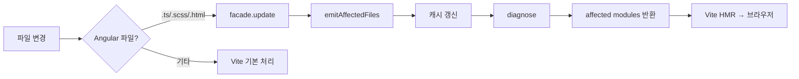
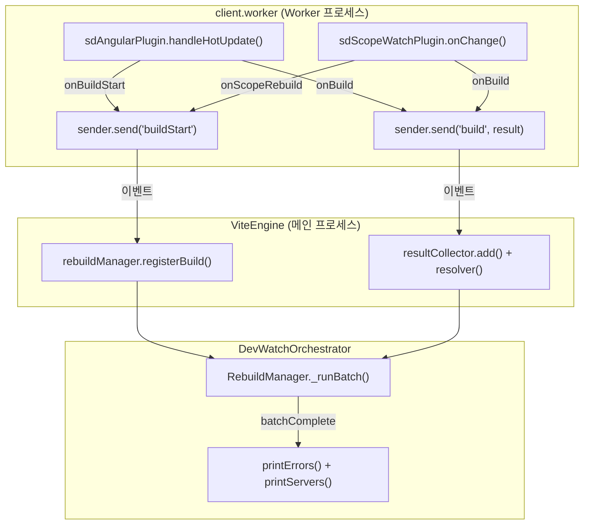

# Feature 3.3 Client 개발 서버 통합

## 참조 자료

- [wbs.md](wbs.md)

### 설계 결정

| # | 결정사항 | 선택 | 근거 |
|---|---------|------|------|
| D1 | HMR 방식 | Angular component HMR | 빠른 피드백, 컴포넌트 상태 유지로 개발 생산성 향상 |
| D2 | CLI rebuild 보고 | rebuilding → rebuild complete 표시 | 소스 변경/의존성 변경 무관하게 통일된 상태 표시 |

## 요구명세

```gherkin
Feature: 3.3 Client 개발 서버 통합

  Background:
    Given Angular Client 패키지가 sd.config.ts에 등록되어 있다
    And dev 명령어가 실행 중이다
    And Client dev server가 브라우저에 앱을 서빙 중이다

  Rule: 소스 파일 변경 시 Angular HMR로 브라우저에 자동 반영된다

    Scenario: Angular 컴포넌트 .ts 파일 수정 시 컴포넌트 HMR
      When Angular 컴포넌트 .ts 파일을 수정한다
      Then CLI에 rebuilding 상태가 표시된다
      And 변경된 컴포넌트만 교체되고 앱 상태는 유지된다
      And CLI에 rebuild complete 상태가 표시된다

    Scenario: Angular 인라인 SCSS 수정 시 CSS HMR
      When Angular 컴포넌트의 인라인 SCSS를 수정한다
      Then CSS 변경이 브라우저에 반영된다

    Scenario: non-Angular .ts 파일 수정
      When Angular emit 대상이 아닌 .ts 파일을 수정한다
      Then Vite esbuild가 기본 처리하여 반영된다

    Scenario: 컴파일 에러 발생 및 복구
      When 컴파일 에러가 있는 코드로 수정한다
      Then CLI에 에러가 표시된다
      When 에러를 수정하고 저장한다
      Then 정상 동작이 복구된다

    Scenario: 새 컴포넌트/서비스 추가 시 full page reload
      When 새 Angular 컴포넌트나 서비스를 추가한다
      Then full page reload가 발생한다

  Rule: 워크스페이스 의존성(replaceDeps) 변경 시 브라우저에 자동 반영된다

    Scenario: 라이브러리 재빌드로 의존성 변경
      Given watch 명령어가 라이브러리를 감시 중이다
      When 라이브러리 소스가 수정되어 재빌드된다
      Then Client dev server가 변경을 감지하여 브라우저를 업데이트한다
      And CLI에 rebuilding → rebuild complete 상태가 표시된다

    Scenario: 여러 라이브러리 파일 동시 변경 시 디바운스
      When 여러 라이브러리 파일이 동시에 변경된다
      Then 디바운스 후 단일 HMR 트리거가 발생한다

    Scenario: replaceDeps가 없는 Client 패키지
      Given Client 패키지에 replaceDeps 설정이 없다
      When dev 명령어를 실행한다
      Then 에러 없이 정상 동작한다

    Scenario: replaceDeps 패키지는 Vite pre-bundling에서 제외된다
      Given Client 패키지에 replaceDeps가 설정되어 있다
      When dev 명령어를 실행한다
      Then replaceDeps 패키지가 Vite optimizeDeps.exclude에 추가된다
```

## 구현계획

### 배경

Feature 3.1에서 ViteEngine과 client.worker가 Vite dev server를 시작하고 Angular AOT 컴파일을 수행한다. 그러나 파일 변경이 반영되지 않는 두 가지 문제가 있다:

1. **stale 캐시**: vite-angular-plugin이 `buildStart`에서 전체 컴파일 후 `emittedFiles` 캐시에 저장하지만, 파일 변경 시 캐시가 갱신되지 않아 `transform`이 이전 코드를 반환한다
2. **replaceDeps 미감지**: sdScopeWatchPlugin이 없어서 워크스페이스 의존성(replaceDeps) dist/ 변경이 Vite에 전달되지 않는다

### 목표

- Angular component HMR: 소스 변경 → SourceFileCache 기반 incremental 재컴파일 → 컴포넌트 교체
- replaceDeps HMR: 의존성 dist/ 변경 → Vite watcher 트리거 → 브라우저 업데이트
- CLI rebuild 상태 표시: ServerEsbuildEngine과 동일한 `buildStart`/`build` → RebuildManager → batchComplete 패턴

### 비목표

- PostCSS/browserslist 통합 (Feature 4.1)
- PWA 지원 (Feature 4.2)
- env/configs 확장 (Feature 3.4)

### 설계

#### AngularFacade.update() 메서드

AngularFacade에 `update(modifiedFiles)` 메서드를 추가한다:
1. `sourceFileCache.modifiedFiles`를 변경 파일로 갱신
2. 이전 compilation을 close
3. 새 compilation을 생성하고 `initialize()` 호출
4. `SourceFileCache`가 이전 컴파일 결과를 캐시하므로 변경된 파일만 재분석된다

이 메서드를 호출한 뒤 `emitAffectedFiles()`로 변경된 파일만 emit하고, `diagnose()`로 진단을 수집한다.

#### vite-angular-plugin HMR 훅

`handleHotUpdate` 훅 추가:



- `handleHotUpdate`: 변경 파일로 `facade.update()` → `emitAffectedFiles()` → 캐시 갱신 → affected modules 반환
- `config`: `ngHmrMode` define 추가 (dev: `undefined`=활성, prod: `"false"`)
- `buildEnd`: dev 모드에서 facade dispose 안 함 (SourceFileCache 유지)
- `configureServer`: server 종료 시 facade cleanup 등록
- `onBuildStart`/`onBuild` 콜백: CLI 상태 보고용

#### sdScopeWatchPlugin (신규)

_back 참조 코드(`src/utils/vite-scope-watch-plugin.ts`)를 포팅한다:
- `config` 훅: replaceDeps 패키지를 `optimizeDeps.exclude`에 추가
- `configureServer` 훅: FsWatcher로 replaceDeps dist/ 감시, 변경 시 `server.watcher.emit("change")` 호출
- `onScopeRebuild` 콜백: CLI 상태 보고용

#### 이벤트 흐름



#### 데이터 흐름 (replaceDeps)

| 계층 | 변경 | 전달 내용 |
|------|------|----------|
| DevWatchOrchestrator | `_replaceDepWatcher.entries`를 ViteEngine 옵션에 추가 | `ReplaceDepEntry[]` |
| ViteEngine | `startWatch()`에서 worker에 전달 | `ClientBuildInfo.replaceDeps` |
| client.worker | `createClientViteConfig()`에 전달 | `CreateClientViteConfigOptions.replaceDeps` |
| vite-config | sdScopeWatchPlugin 생성 시 전달 | `SdScopeWatchPluginOptions.replaceDeps` |

### 대안 검토

| 접근 방식 | 선택 | 이유 |
|-----------|------|------|
| SourceFileCache 기반 재초기화 | **채택** | SourceFileCache가 이전 컴파일 결과를 캐시하여 incremental 동작 보장. compilation.update() 미구현 시에도 동작 |
| compilation.update() 직접 사용 | 미채택 | optional 메서드로 구현 보장 불가. 재초기화 방식이 범용적 |
| 매번 전체 재컴파일 (캐시 없이) | 미채택 | 너무 느림, HMR 목적에 부적합 |
| @angular/build 내부 setupServer 사용 | 미채택 | Angular CLI 내부 API에 강하게 결합, Vite 설정 제어 불가 |

### Vertical Slices

#### Slice 1: Angular HMR + CLI rebuild 이벤트

- [x] **구현 내용:** AngularFacade에 `update()` 메서드 추가. vite-angular-plugin에 `handleHotUpdate`/`configureServer` 훅, `ngHmrMode` define, `onBuildStart`/`onBuild` 콜백 추가. client.worker에서 콜백을 이벤트로 전환하여 발송. ViteEngine에서 `buildStart`/`build` 이벤트를 RebuildManager에 연동. vite-config에 콜백 옵션 추가.
- **Scenarios:**
  - Scenario: Angular 컴포넌트 .ts 파일 수정 시 컴포넌트 HMR
  - Scenario: Angular 인라인 SCSS 수정 시 CSS HMR
  - Scenario: non-Angular .ts 파일 수정
  - Scenario: 컴파일 에러 발생 및 복구
  - Scenario: 새 컴포넌트/서비스 추가 시 full page reload

#### Slice 2: sdScopeWatchPlugin + replaceDeps 전달

- [x] **구현 내용:** `src/utils/vite-scope-watch-plugin.ts` 생성 (_back 포팅). ClientBuildInfo/CreateClientViteConfigOptions에 `replaceDeps` 필드 추가. DevWatchOrchestrator → ViteEngine → client.worker → vite-config → sdScopeWatchPlugin 데이터 흐름 구성. scopeRebuild 콜백을 Slice 1의 이벤트 흐름에 연결.
- **의존:** Slice 1 (이벤트 흐름 재사용)
- **Scenarios:**
  - Scenario: 라이브러리 재빌드로 의존성 변경
  - Scenario: 여러 라이브러리 파일 동시 변경 시 디바운스
  - Scenario: replaceDeps가 없는 Client 패키지
  - Scenario: replaceDeps 패키지는 Vite pre-bundling에서 제외된다
