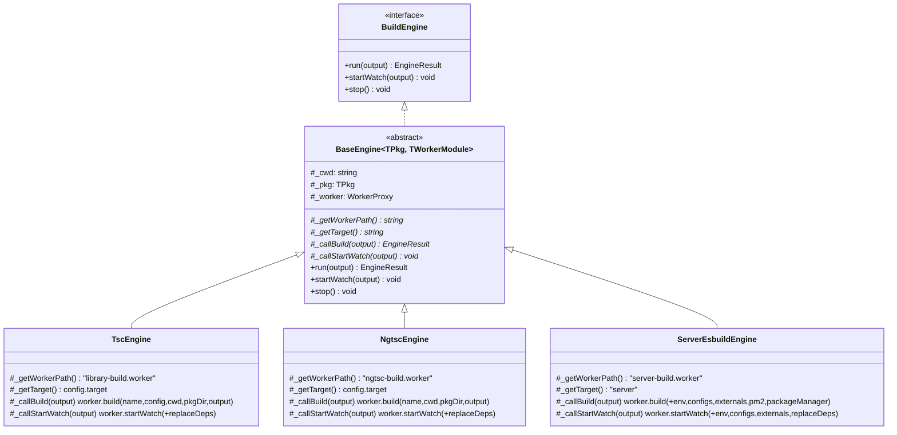

# Feature 4.1 Engine 공통 베이스 추출

## 참조 자료

- [wbs.md](wbs.md)

### 엔진 코드 현황

| 엔진 | 파일 | 라인 | pkg 타입 | worker 경로 |
|------|------|------|----------|------------|
| TscEngine | `packages/sd-cli/src/engines/TscEngine.ts` | 195 | `BuildPackageInfo` | `library-build.worker` |
| NgtscEngine | `packages/sd-cli/src/engines/NgtscEngine.ts` | 196 | `BuildPackageInfo` | `ngtsc-build.worker` |
| ServerEsbuildEngine | `packages/sd-cli/src/engines/ServerEsbuildEngine.ts` | 201 | `ServerPackageInfo` | `server-build.worker` |

### 메서드별 중복/차이 분석

| 메서드 | 동일 비율 | 차이점 |
|--------|----------|--------|
| `stop()` (19줄) | 100% | 없음 |
| Constructor (6줄) | 100% | 없음 |
| `_createWorker()` (4줄) | 구조 동일 | worker 경로만 다름 |
| `startWatch()` 이벤트 초기화 + 핸들러 (~80줄) | 95% | target 결정: TscEngine/NgtscEngine은 `config.target`, ServerEsbuildEngine은 `"server"` 하드코딩 |
| `run()` (~25-30줄) | 50% | worker.build() 파라미터가 엔진마다 다름 |
| `startWatch()` worker 호출 (~10줄) | 50% | worker.startWatch() 파라미터가 엔진마다 다름 |

### run() 파라미터 차이

- **TscEngine:** `name, config, cwd, pkgDir, output`
- **NgtscEngine:** `name, cwd, pkgDir, output` (config 없음)
- **ServerEsbuildEngine:** `name, cwd, pkgDir, output, env, configs, externals, pm2, packageManager`

### startWatch() 파라미터 차이

- **TscEngine:** `name, config, cwd, pkgDir, output, replaceDeps`
- **NgtscEngine:** `name, cwd, pkgDir, output, replaceDeps` (config 없음)
- **ServerEsbuildEngine:** `name, cwd, pkgDir, output, env, configs, externals, replaceDeps`

### 공통 Worker 이벤트 구조

3개 worker 모두 동일한 이벤트 이름과 구조를 가진다:

| 이벤트 | 타입 | 비고 |
|--------|------|------|
| `buildStart` | `Record<string, never>` | 3개 동일 |
| `build` | `{ js: { success, errors?, warnings? }, dts: { success, errors?, diagnostics? } }` | 페이로드 타입명만 다름 (CombinedBuildEvent / NgtscCombinedBuildEvent / ServerCombinedBuildEvent) |
| `error` | `{ message: string }` | 3개 동일 |

3개 worker 모두 동일한 메서드 시그니처 구조를 가진다: `build()`, `startWatch()`, `stopWatch()`

### 설계 결정

| # | 결정사항 | 선택 | 근거 |
|---|---------|------|------|
| — | — | — | ASSUMED 항목 없음 — 모든 사항이 코드에서 직접 확인됨 |

## 요구명세

```gherkin
Feature: 4.1 Engine 공통 베이스 추출


  Background:
    Given 3개 엔진(TscEngine, NgtscEngine, ServerEsbuildEngine)이 존재한다
    And ViteEngine은 변경 대상이 아니다

  Rule: 공통 로직은 베이스 클래스에 구현한다

    Scenario: stop() 메서드가 베이스에 한 곳만 존재한다
      Given 3개 엔진이 동일한 stop() 구현(shutdownTimeout, Promise.race, terminate)을 가진다
      When 베이스 클래스로 추출한다
      Then stop()은 베이스 클래스에 한 곳에만 존재한다
      And 3개 서브클래스 모두 베이스의 stop()을 그대로 사용한다

    Scenario: Constructor가 베이스에 한 곳만 존재한다
      Given 3개 엔진이 동일한 property 할당(cwd, pkg, replaceDeps, resultCollector, rebuildManager)을 가진다
      When 베이스 클래스로 추출한다
      Then constructor는 베이스 클래스에 한 곳에만 존재한다

    Scenario: startWatch() 이벤트 핸들링이 베이스에 한 곳만 존재한다
      Given 3개 엔진이 동일한 이벤트 초기화(isWatchMode, worker 생성, Promise 래핑)를 가진다
      And buildStart/build/error 핸들러가 95% 동일하다
      When 베이스 클래스로 추출한다
      Then 이벤트 초기화 및 핸들러 등록은 베이스에 한 곳에만 존재한다
      And target 결정은 서브클래스의 추상 메서드로 위임한다

    Scenario: _createWorker() 호출 패턴이 베이스에 구현된다
      Given Worker.create() 호출 패턴이 3개 엔진에서 동일하다
      When 베이스 클래스로 추출한다
      Then _createWorker()는 베이스에서 구현하고 worker 경로는 서브클래스가 제공한다

  Rule: 서브클래스는 엔진별 차이점만 제공한다

    Scenario: TscEngine이 worker 경로와 파라미터를 제공한다
      Given TscEngine이 BaseEngine을 상속한다
      When run()이 호출된다
      Then worker 경로로 "library-build.worker"를 반환한다
      And worker.build() 파라미터에 config를 포함한다

    Scenario: NgtscEngine이 worker 경로와 파라미터를 제공한다
      Given NgtscEngine이 BaseEngine을 상속한다
      When run()이 호출된다
      Then worker 경로로 "ngtsc-build.worker"를 반환한다
      And worker.build() 파라미터에 config를 포함하지 않는다

    Scenario: ServerEsbuildEngine이 worker 경로와 파라미터를 제공한다
      Given ServerEsbuildEngine이 BaseEngine을 상속한다
      When run()이 호출된다
      Then worker 경로로 "server-build.worker"를 반환한다
      And worker.build() 파라미터에 env, configs, externals, pm2, packageManager를 포함한다

    Scenario: ServerEsbuildEngine이 target을 "server"로 반환한다
      Given ServerEsbuildEngine의 BuildResult target은 "server"이다
      When startWatch()에서 이벤트 핸들러가 BuildResult를 생성한다
      Then target은 "server" 문자열이다
      And TscEngine/NgtscEngine은 config.target 값을 사용한다

  Rule: 기존 3개 엔진을 베이스 기반으로 전환한다

    Scenario: TscEngine을 BaseEngine 상속으로 전환한다
      Given 기존 TscEngine이 독립 클래스이다
      When BaseEngine 상속으로 전환한다
      Then TscEngine은 BaseEngine<BuildPackageInfo>를 상속한다
      And 기존 동작이 변경되지 않는다

    Scenario: NgtscEngine을 BaseEngine 상속으로 전환한다
      Given 기존 NgtscEngine이 독립 클래스이다
      When BaseEngine 상속으로 전환한다
      Then NgtscEngine은 BaseEngine<BuildPackageInfo>를 상속한다
      And 기존 동작이 변경되지 않는다

    Scenario: ServerEsbuildEngine을 BaseEngine 상속으로 전환한다
      Given 기존 ServerEsbuildEngine이 독립 클래스이다
      When BaseEngine 상속으로 전환한다
      Then ServerEsbuildEngine은 BaseEngine<ServerPackageInfo>를 상속한다
      And 기존 동작이 변경되지 않는다

  Rule: BuildEngine 인터페이스 계약을 유지한다

    Scenario: 전환 후 인터페이스 시그니처가 동일하다
      Given BaseEngine 상속으로 전환이 완료되었다
      When 외부에서 BuildEngine 인터페이스로 접근한다
      Then run(output), startWatch(output), stop() 시그니처가 변경 전과 동일하다

    Scenario: ViteEngine은 변경하지 않는다
      Given ViteEngine은 worker 이벤트 구조가 다르다
      When 베이스 추출 리팩토링을 수행한다
      Then ViteEngine 코드는 변경되지 않는다
```

## 구현계획

### 배경

TscEngine, NgtscEngine, ServerEsbuildEngine 3개 엔진이 ~110줄의 순수 중복 코드를 가진다. constructor, stop(), startWatch() 이벤트 핸들링이 거의 동일하고, 차이점은 worker 경로, worker 호출 파라미터, BuildResult target 결정뿐이다.

### 목표

- 3개 엔진의 공통 로직을 `BaseEngine` 추상 클래스로 추출
- 각 서브클래스는 엔진별 차이점(worker 경로, 파라미터, target)만 구현
- 기존 동작과 BuildEngine 인터페이스 계약을 완전히 유지

### 비목표

- ViteEngine 변경 (worker 이벤트 구조가 다름)
- Worker 모듈 코드 변경 (엔진 레이어만 리팩토링)
- createBuildEngine 팩토리 변경 (인스턴스화 방식 동일)

### 설계

#### BaseEngine 추상 클래스

```typescript
// packages/sd-cli/src/engines/BaseEngine.ts

// 공통 worker 이벤트 타입
interface CommonBuildWorkerEvents extends Record<string, unknown> {
  buildStart: Record<string, never>;
  build: {
    js: { success: boolean; errors?: string[]; warnings?: string[] };
    dts: { success: boolean; errors?: string[]; diagnostics?: SerializedDiagnostic[] };
  };
  error: { message: string };
}

// 공통 worker 모듈 타입 (이벤트 + stopWatch만 필요)
interface CommonBuildWorkerModule {
  default: {
    __methods: {
      stopWatch: () => Promise<void>;
      [key: string]: (...args: never[]) => unknown;
    };
    __events: CommonBuildWorkerEvents;
  };
}

interface BaseEngineOptions<TPkg extends PackageInfo> {
  cwd: string;
  pkg: TPkg;
  replaceDeps?: Record<string, string>;
  resultCollector?: ResultCollector;
  rebuildManager?: RebuildManager;
}

abstract class BaseEngine<
  TPkg extends PackageInfo,
  TWorkerModule extends CommonBuildWorkerModule,
> implements BuildEngine {
  // 공통 프로퍼티
  protected readonly _cwd: string;
  protected readonly _pkg: TPkg;
  protected readonly _replaceDeps: Record<string, string> | undefined;
  protected readonly _resultCollector: ResultCollector | undefined;
  protected readonly _rebuildManager: RebuildManager | undefined;
  protected _worker: WorkerProxy<TWorkerModule> | undefined;
  private _isWatchMode = false;

  // 서브클래스가 구현할 abstract 메서드
  protected abstract _getWorkerPath(): string;
  protected abstract _getTarget(): string;
  protected abstract _callBuild(output: BuildOutput): Promise<EngineResult>;
  protected abstract _callStartWatch(output: BuildOutput): Promise<void>;

  // 공통 구현: constructor
  constructor(options: BaseEngineOptions<TPkg>) { ... }

  // 공통 구현: _createWorker
  protected _createWorker(): void {
    this._worker = Worker.create<TWorkerModule>(this._getWorkerPath());
  }

  // 공통 구현: run (worker 생성 → _callBuild 위임 → 정리)
  async run(output: BuildOutput): Promise<EngineResult> {
    this._createWorker();
    try {
      return await this._callBuild(output);
    } finally {
      await this._worker!.terminate();
      this._worker = undefined;
    }
  }

  // 공통 구현: startWatch (이벤트 초기화 + 핸들러 + _callStartWatch 위임)
  async startWatch(output: BuildOutput): Promise<void> { ... }

  // 공통 구현: stop (3개 엔진 100% 동일)
  async stop(): Promise<void> { ... }
}
```

#### Template Method 패턴



#### run() 메서드 분리

기존 run()은 (1) worker 생성, (2) worker.build() 호출, (3) 결과 매핑, (4) worker 종료의 4단계이다. (2)와 (3)은 엔진마다 다르므로 `_callBuild()`로 위임하고, (1)과 (4)는 베이스에서 처리한다.

단, 결과 매핑(EngineResult 생성)은 3개 엔진에서 동일하지만, worker.build() 반환 타입이 다르므로 `_callBuild()`가 매핑까지 포함하여 EngineResult를 반환한다. 서브클래스에서 2~3줄의 매핑 코드가 중복되지만, 공통 매핑 유틸을 추출할 만큼 복잡하지 않다.

#### startWatch() 메서드 분리

기존 startWatch()는 (1) worker 생성, (2) 이벤트 핸들러 등록, (3) worker.startWatch() 호출의 3단계이다. (1)과 (2)는 베이스에서 처리하고, (3)만 `_callStartWatch()`로 위임한다. target 결정은 `_getTarget()`으로 위임하여 이벤트 핸들러의 유일한 차이점을 해소한다.

### 대안 검토

| 접근 방식 | 선택 여부 | 이유 |
|-----------|-----------|------|
| Template Method (채택) | 채택 | 공통 골격을 베이스에, 변형점만 서브클래스에. 기존 코드 구조와 자연스럽게 대응 |
| Strategy 패턴 (합성) | 미채택 | worker 파라미터가 엔진 내부 상태(pkg config)에 의존하므로 별도 Strategy로 분리하면 오히려 결합 증가 |
| 유틸 함수 추출만 | 미채택 | stop(), startWatch() 이벤트 핸들링이 상태(worker, isWatchMode)에 밀접하므로 순수 함수로 추출 불가 |

### Vertical Slices

#### Slice 1: BaseEngine + TscEngine 전환
- [x] **구현 내용:** BaseEngine 추상 클래스 생성, CommonBuildWorkerEvents/CommonBuildWorkerModule 타입 정의, TscEngine을 BaseEngine 상속으로 전환
- **의존:** 없음
- **Scenarios:**
  - Scenario: stop() 메서드가 베이스에 한 곳만 존재한다
  - Scenario: Constructor가 베이스에 한 곳만 존재한다
  - Scenario: startWatch() 이벤트 핸들링이 베이스에 한 곳만 존재한다
  - Scenario: _createWorker() 호출 패턴이 베이스에 구현된다
  - Scenario: TscEngine이 worker 경로와 파라미터를 제공한다
  - Scenario: TscEngine을 BaseEngine 상속으로 전환한다
  - Scenario: 전환 후 인터페이스 시그니처가 동일하다

#### Slice 2: NgtscEngine 전환
- [x] **구현 내용:** NgtscEngine을 BaseEngine 상속으로 전환
- **의존:** Slice 1
- **Scenarios:**
  - Scenario: NgtscEngine이 worker 경로와 파라미터를 제공한다
  - Scenario: NgtscEngine을 BaseEngine 상속으로 전환한다

#### Slice 3: ServerEsbuildEngine 전환
- [x] **구현 내용:** ServerEsbuildEngine을 BaseEngine 상속으로 전환
- **의존:** Slice 1
- **Scenarios:**
  - Scenario: ServerEsbuildEngine이 worker 경로와 파라미터를 제공한다
  - Scenario: ServerEsbuildEngine이 target을 "server"로 반환한다
  - Scenario: ServerEsbuildEngine을 BaseEngine 상속으로 전환한다
  - Scenario: ViteEngine은 변경하지 않는다
