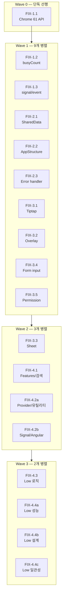

# WBS

## Impact Mapping

- **Goal:** 리뷰에서 발견된 이슈를 수정하여 @simplysm/angular v14의 런타임 안정성과 일관성을 확보한다
  - **Actor:** simplysm 프레임워크 사용 개발자
    - **Impact:** 런타임 버그 없이 안정적으로 UI 컴포넌트를 사용한다
      - **Deliverable:** Critical/Medium 이슈가 수정된 @simplysm/angular 패키지
    - **Impact:** Chrome 61+ 환경에서 에러 없이 동작한다
      - **Deliverable:** 런타임 API 호환성 수정
    - **Impact:** 코드베이스 전반의 패턴이 통일되어 유지보수가 용이하다
      - **Deliverable:** Low severity 이슈 수정 및 일관성 개선

## Feature Breakdown

> 각 Feature의 범위 힌트(`-` 불릿)는 대표 예시이며 전체 목록이 아니다. 정식 분해는 `/sd-dev-spec`에서 수행한다.
> 각 Feature는 리뷰 이슈 ID(`LOGIC-XXX` 등)로 대상을 특정한다.

### Epic 1. 크리티컬 인프라 수정

- [ ] Feature 1.1 Chrome 61+ 런타임 API 호환성
  - 비동기 마이크로태스크 API를 Chrome 61 호환 대안으로 교체 (6곳)
  - 클립보드 API에 구형 브라우저 폴백 추가
  - 대상: LOGIC-008

- [x] Feature 1.2 busyCount try-finally 패턴 통일
  - async 작업의 busy 카운터 증감에 예외 안전성 보장
  - 공통 유틸리티 함수 추출
  - 대상: LOGIC-004

- [x] Feature 1.3 Core signal/event 콜백 안전성
  - model signal의 update 경로에도 변경 가드 적용
  - Observer 콜백의 batch 엔트리 처리 안전성 확보
  - 대상: LOGIC-001, LOGIC-009

### Epic 2. Core 인프라 수정

- [x] Feature 2.1 SharedData provider 에러 및 정합성
  - 이벤트 콜백의 미처리 에러를 에러 핸들러로 라우팅
  - 키 타입 혼재(string vs number) 시 비교 실패 방지
  - 동시 로드 요청 방지
  - 대상: LOGIC-003, LOGIC-012, LOGIC-013

- [x] Feature 2.2 AppStructure 체인 검증 및 권한
  - 중간 코드 누락 시 partial chain 대신 명시적 실패 처리
  - 권한 레코드 미로딩 상태와 "권한 미정의" 상태 구분
  - 대상: LOGIC-007, LOGIC-014

- [x] Feature 2.3 Error handler 및 앱 초기화
  - 에러 이벤트의 정보 소실 방지
  - 에러 오버레이 표시 실패 시 폴백 메시지 제공
  - 네비게이션 busy 카운터 음수 방지
  - 대상: LOGIC-010, LOGIC-011, LOGIC-016

### Epic 3. UI 컴포넌트 수정

- [x] Feature 3.1 Tiptap editor 동기화
  - 에디터→모델 동기화의 비동기 가드를 값 비교 방식으로 교체
  - 템플릿 바인딩 상태를 반응형으로 전환
  - 대상: LOGIC-002, DESIGN-004

- [x] Feature 3.2 Overlay 위치 계산 및 lifecycle
  - 드롭다운/모달의 좌표 계산을 viewport 기준으로 통일
  - 팝업 닫힘 시 인라인 스타일 잔류 방지
  - 모달 z-index 파싱 안전성 확보
  - 토스트 자동 해제의 중복 실행 및 상태 동기화 수정
  - 대상: LOGIC-022, LOGIC-023, LOGIC-024, LOGIC-031, LOGIC-032, LOGIC-033

- [x] Feature 3.3 Sheet 컴포넌트 로직 및 성능
  - 편집 모드 진입 시 stale DOM 참조 방지
  - fixed header의 z-index 우선순위 수정
  - width/collapse 동시 설정 시 모순 스타일 제거
  - 셀 단위 메서드 호출의 성능 최적화
  - expanding manager의 가시성 판정 Set 캐싱
  - 대상: LOGIC-006, LOGIC-025, LOGIC-026, PERF-001, PERF-002

- [x] Feature 3.4 Form input 수정
  - 단일 선택 모드에서 stale 표시 텍스트 방지
  - 기간 선택기의 날짜 정규화 통일
  - ~~숫자 입력의 소수점 중간 입력 상태 보존~~ (LOGIC-021 제외: false positive — `num.parseFloat("5.")`=5, 양방향 effect 가드 정상 작동)
  - 대상: LOGIC-019, LOGIC-020

- [x] Feature 3.5 Permission table 수정
  - cascade 체크 시 signal이 아닌 로컬 값 참조로 stale 방지
  - collapse icon 방향 반전 수정
  - 템플릿 배열 생성 메서드 메모이제이션
  - 대상: LOGIC-005, LOGIC-030, PERF-003

### Epic 4. 기타 수정 및 개선

- [x] Feature 4.1 Features 컴포넌트 및 검색 통일
  - 외부 스크립트 로드 실패 시 에러 핸들링 추가
  - 데이터 상세의 dataInfo null 상태 명시적 처리
  - 데이터 시트의 effect 이중 트리거 방지
  - 드롭다운 닫힘 감지 effect의 초기 실행 보호
  - 검색 로직(대소문자, 공백 분리)을 프레임워크 내 통일
  - 대상: LOGIC-027, LOGIC-028, LOGIC-029, LOGIC-035, CONSIST-001

- [x] Feature 4.2a Provider 및 유틸리티 안전성
  - 인쇄 대기 폴링에 타임아웃 추가
  - 시스템 설정 리소스의 undefined 키 가드 및 this 바인딩 수정
  - 파일 다이얼로그 cancel 감지 개선
  - 대상: LOGIC-015, LOGIC-017, LOGIC-018, DESIGN-002

- [x] Feature 4.2b Signal 패턴 및 Angular 내부 의존
  - effect 내 signal 미추적 패턴 수정
  - Angular 내부 구현 의존(injectParent) 방어 코드 추가
  - 모달 required input 타이밍 안전성 확보
  - 대상: LOGIC-034, DESIGN-001, DESIGN-003

- [x] Feature 4.3 Low - 로직 안전성 일괄 수정
  - localStorage 파싱 안전성
  - URL 해시 파싱 edge case 방어
  - SW 폴링 backoff
  - 테마 persistence multi-tab 충돌 방지
  - 모달/dock/progress 등 인라인 스타일 edge case 클램프
  - 라우터 링크, 주소 검색 등 기타 방어 코드
  - 대상: LOGIC-036 ~ LOGIC-047

- [x] Feature 4.4a Low - 성능 최적화
  - 선택 컴포넌트 contentHTML 추적 최적화
  - sheet isExpanded Set 기반 lookup
  - ~~data-sheet diff 캐싱~~ (PERF-006 제외: items가 in-place mutation되어 signal 기반 캐싱 불가, 사용자 액션에서만 호출되므로 실질적 성능 영향 미미)
  - 대상: PERF-004, PERF-005

- [x] Feature 4.4b Low - 설계 개선
  - 드롭다운 팝업 높이 제한 로직 개선
  - sheet column fixing 문서화
  - 바코드 innerHTML sanitization
  - 대상: DESIGN-005, DESIGN-006, DESIGN-007

- [x] Feature 4.4c Low - 일관성 통일
  - DOCUMENT 토큰 사용 통일
  - 메뉴 인터페이스 중복 제거
  - fixed cell 배경색 통일
  - SharedData valueKey 타입 통일
  - 이벤트 타입 분리
  - 대상: CONSIST-002, CONSIST-003, CONSIST-004, CONSIST-005, CONSIST-006

## 실행 계획 (병렬/순차)

FIX-1.1(Chrome 61 API)이 6개 파일을 수정하므로 반드시 단독 선행해야 한다. 이후 Wave별로 파일 충돌이 없는 Feature를 병렬 실행한다.

### Wave별 상세

| Wave | 병렬 수 | Feature | 선행 조건 (파일 충돌 근거) |
|------|---------|---------|--------------------------|
| 0 | 1 | **1.1** | 없음. queueMicrotask가 6개 파일에 분포하여 단독 선행 |
| 1 | 9 | **1.2, 1.3, 2.1, 2.2, 2.3, 3.1, 3.2, 3.4, 3.5** | Wave 0. FIX-1.2·3.2가 FIX-1.1과 동일 파일 수정 |
| 2 | 4 | **3.3, 4.1, 4.2a, 4.2b** | Wave 1. 3.3←1.1(useSheetCellAgent), 4.1←1.2(data-view), 4.2a←1.1(systemConfig) |
| 3 | 4 | **4.3, 4.4a, 4.4b, 4.4c** | Wave 2. 4.3←3.2(modal/dropdown), 4.4a←3.3(sheet)·4.1(data-sheet), 4.4b←3.3(useSheetColumnFixing), 4.4c 독립 |

### FIX-1.1 파일 충돌 상세

FIX-1.1이 수정하는 6개 파일과 후속 Feature의 충돌:

| FIX-1.1 수정 파일 | 충돌 Feature | Wave |
|-------------------|-------------|------|
| sd-data-detail.control.ts | FIX-1.2, FIX-4.1 | 1, 2 |
| sd-data-select-button.control.ts | FIX-1.2 | 1 |
| sd-data-sheet.control.ts | FIX-1.2, FIX-4.1, FIX-4.4 | 1, 2, 3 |
| sd-modal.provider.ts | FIX-3.2 | 1 |
| useSheetCellAgent.ts | FIX-3.3 | 2 |
| useSdSystemConfigResource.ts | FIX-4.2 | 2 |

## 참조 자료

### 리뷰 리포트
- 전체 이슈 상세: `.tasks/260331222005_review-angular-migration/review.md`
- 각 이슈는 `id`, `severity`, `location`, `description`, `suggestion`을 포함

### 의존성 관계
- FIX-1.1은 6개 파일을 수정하여 Wave 0에서 단독 선행 (상세는 실행 계획 참조)
- FIX-3.3 ← FIX-1.1: useSheetCellAgent.ts 공유
- FIX-4.1 ← FIX-1.2: sd-data-detail, sd-data-sheet 공유
- FIX-4.2a ← FIX-1.1: useSdSystemConfigResource.ts 공유
- FIX-4.2b: 독립적 파일만 수정 (setupRevealOnShow, injectParent, sd-sheet-config.modal)
- FIX-4.3 ← FIX-3.2: sd-modal.control.ts, sd-dropdown.control.ts 공유
- FIX-4.4a ← FIX-3.3, FIX-4.1: sd-sheet.control.ts, sd-data-sheet.control.ts 공유
- FIX-4.4b ← FIX-3.3: useSheetColumnFixing.ts 공유
- FIX-4.4c: 독립적 파일만 수정

### Chrome 61 호환 필수 대체 API
- `queueMicrotask` (Chrome 71+) → `Promise.resolve().then()` (전체 호환)
- `navigator.clipboard` (Chrome 66+) → `document.execCommand("copy"/"paste")` (Chrome 43+)

### 참조 파일
- `packages/angular/src/` — 전체 수정 대상 디렉토리
- `.tasks/260325202210_angular-migration/wbs.md` — 원본 마이그레이션 WBS. 각 Feature의 원래 설계 의도를 확인한다
- `packages/angular/src/core/utils/setups/setupModelHook.ts` — LOGIC-001의 핵심 파일. WritableSignal.update도 오버라이드해야 한다
- `packages/angular/src/ui/data/sheet/useSheetCellAgent.ts` — FIX-1.1과 FIX-3.3이 동시 수정하는 파일
- `packages/angular/src/features/data-view/sd-data-sheet.control.ts` — FIX-1.2와 FIX-4.1이 동시 수정하는 파일

## 제외 사항

- 리뷰에서 보고하지 않은 영역 (타입 에러, 린트 규칙, 코드 스타일) — sd-check 범위
- 런타임 성능 수치 측정 — 리뷰에서 확정적 단정 불가로 제외한 항목
- 새로운 기능 추가 — 리뷰 이슈 수정만 범위에 포함
