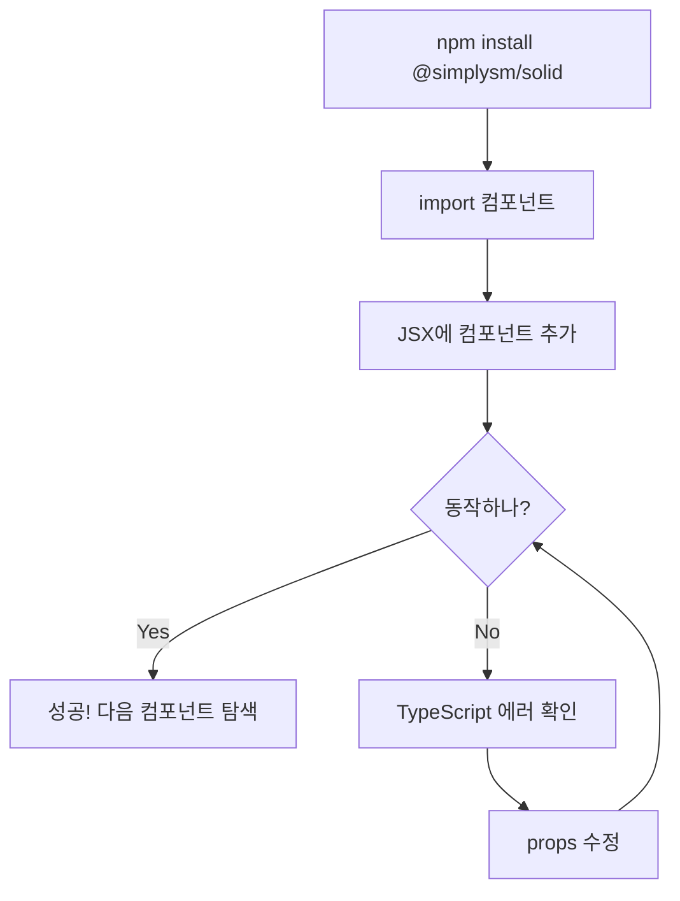
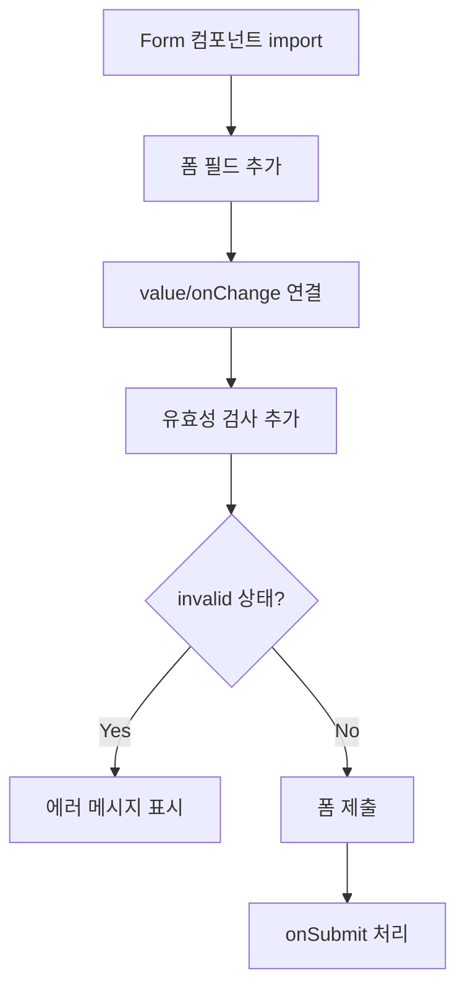
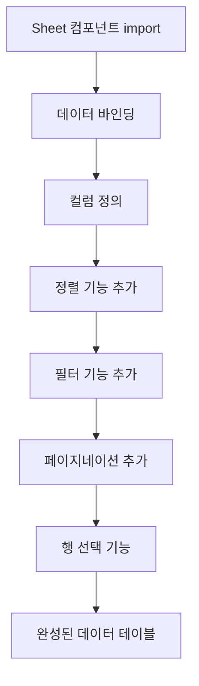
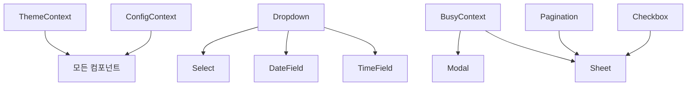

# UX Design Specification @simplysm/solid

**Author:** 김석래
**Date:** 2026-02-01

---

## Executive Summary

### Project Vision

sd-angular UI 프레임워크를 SolidJS로 완전히 마이그레이션하여 @simplysm/solid 단일 UI 패키지로 통합한다. SolidJS의 fine-grained reactivity를 활용한 고성능 UI 컴포넌트를 제공하며, vanilla-extract 기반의 통합 스타일링 시스템으로 테마 일관성을 유지한다.

**핵심 가치:**
- 개발자가 SolidJS로 관리자 페이지를 빠르게 만들 수 있는 UI 컴포넌트 라이브러리
- 기존 sd-angular의 검증된 기능을 현대적 프레임워크로 제공
- Angular 의존성 제거로 프레임워크 단순화

### Target Users

**Primary User: SolidJS 개발자**
- SolidJS로 사내 관리자/업무 시스템을 개발하는 개발자
- 테이블, 폼, 모달 등 복잡한 UI가 필요한 프로젝트 담당자
- 기술 수준: 중급 이상 (TypeScript, SolidJS 경험)
- Angular 경험은 필수가 아님

**사용 환경:**
- 최신 Chrome, Firefox, Safari, Edge 브라우저
- 데스크톱 중심, 모바일 지원 (520px 브레이크포인트)
- IDE: VSCode + TypeScript LSP

### Key Design Challenges

| 도전 과제 | 설명 | 영향 |
|----------|------|------|
| API 일관성 | Angular에서 SolidJS로의 패턴 변환 시 일관된 API 유지 | 학습 곡선, 개발자 경험 |
| 컴포넌트 통일성 | 35개+ 컴포넌트의 동일한 UX 패턴 및 시각적 언어 | 사용성, 브랜드 일관성 |
| 반응형 UX | 520px 브레이크포인트에서 모바일 UI 자연스러운 전환 | 접근성, 다양한 기기 지원 |
| Sheet 복잡도 | 1,000행+ 가상 스크롤, 정렬/필터/선택 기능 | 성능, 사용성 |
| 접근성 | 모든 컴포넌트 키보드 네비게이션 지원 | 접근성 준수 |

### Design Opportunities

| 기회 영역 | 설명 | 잠재적 가치 |
|----------|------|------------|
| 테마 시스템 | vanilla-extract 기반 다크/라이트 모드 원활한 전환 | 사용자 선호 존중, 눈 피로 감소 |
| 개발자 경험 (DX) | 직관적인 API, 좋은 기본값, TypeScript 타입 지원 | 빠른 온보딩, 생산성 향상 |
| 일관된 피드백 | 로딩, 에러, 성공 상태의 통일된 시각적 언어 | 예측 가능한 UX |
| 폼 유효성 검사 | invalid directive를 통한 일관된 유효성 표시 | 사용자 오류 감소 |

## Core User Experience

### Defining Experience

**핵심 사용자 액션:** 개발자가 컴포넌트를 import하고 props를 설정하여 즉시 동작하는 UI를 얻는 것

개발자 경험(DX) 중심의 UI 컴포넌트 라이브러리로서, 핵심 경험은:
1. **즉시 사용 가능** - import 후 바로 동작하는 좋은 기본값
2. **예측 가능한 API** - 모든 컴포넌트가 일관된 props 패턴 (`value`/`onChange`, `disabled`, `invalid`)
3. **시각적 완성도** - 추가 스타일링 없이도 프로덕션 품질의 UI

### Platform Strategy

| 항목 | 결정 | 근거 |
|------|------|------|
| 플랫폼 | 웹 브라우저 전용 | SolidJS 웹 프레임워크 |
| 입력 방식 | 마우스/키보드 우선, 터치 지원 | 관리자 시스템은 데스크톱 중심 |
| 반응형 | 520px 브레이크포인트 | 태블릿/모바일 지원 |
| 오프라인 | 지원 안 함 | 관리자 시스템은 온라인 필수 |
| 브라우저 | Chrome, Firefox, Safari, Edge 최신 버전 | 모던 브라우저 타겟 |

### Effortless Interactions

**제로 설정으로 동작해야 하는 것들:**
- 테마 (다크/라이트) 자동 감지 및 전환
- 폼 컴포넌트 포커스 스타일 및 키보드 네비게이션
- 드롭다운/모달 외부 클릭 닫기
- 유효성 검사 메시지 표시 위치 및 스타일

**자동으로 처리되어야 하는 것들:**
- 가상 스크롤 (Sheet에서 1,000행+ 처리)
- 리플 효과 (Button, 클릭 가능한 요소)
- 반응형 레이아웃 전환

### Critical Success Moments

| 순간 | 설명 | 성공 기준 |
|------|------|----------|
| 첫 사용 | 첫 컴포넌트 렌더링 | import → JSX → 동작하는 UI까지 3분 이내 |
| 폼 구성 | 폼 컴포넌트 조합 | 10개 필드 폼을 15분 내 완성 |
| 데이터 표시 | Sheet로 테이블 구현 | 정렬/필터/페이지네이션 30분 내 구현 |
| 테마 적용 | 다크/라이트 모드 | ThemeProvider 감싸기만으로 완료 |
| 에러 처리 | 유효성 검사 표시 | invalid prop만으로 스타일 자동 적용 |

### Experience Principles

1. **Convention over Configuration** - 기본값이 대부분의 경우에 적합하도록 설계. 커스터마이징은 가능하지만 필수가 아님
2. **Predictable API** - 모든 컴포넌트가 동일한 패턴 (`value`/`onChange`, `size`, `disabled`, `invalid`)
3. **Visual Consistency** - themeVars와 atoms를 통해 일관된 시각적 언어
4. **Progressive Disclosure** - 기본 사용은 간단하게, 고급 기능은 필요할 때만 노출
5. **Fail Gracefully** - 잘못된 props에도 에러 없이 합리적인 폴백 동작

## Desired Emotional Response

### Primary Emotional Goals

| 감정 | 설명 | 중요도 |
|------|------|--------|
| **자신감 (Confidence)** | "이 라이브러리로 뭐든 만들 수 있다" | ⭐⭐⭐ |
| **효율성 (Efficiency)** | "시간을 절약하고 있다" | ⭐⭐⭐ |
| **신뢰 (Trust)** | "이건 잘 만들어졌고 안정적이다" | ⭐⭐⭐ |
| **만족 (Satisfaction)** | "내 앱이 프로페셔널해 보인다" | ⭐⭐ |

### Emotional Journey Mapping

| 단계 | 기대 감정 | 트리거 |
|------|----------|--------|
| 발견 | 호기심, 기대 | 문서, 데모 페이지 |
| 설치 | 안도, 간편함 | 단순한 설치 과정 |
| 첫 사용 | 놀라움, 기쁨 | 즉시 동작하는 컴포넌트 |
| 심화 사용 | 자신감, 생산성 | 복잡한 UI 빠르게 구현 |
| 문제 발생 | 차분함, 해결 가능 | 명확한 에러 메시지, 문서 |
| 재사용 | 친숙함, 편안함 | 일관된 API 패턴 |

### Micro-Emotions

**추구해야 할 감정:**
- ✅ 자신감 vs ~~혼란~~
- ✅ 신뢰 vs ~~의심~~
- ✅ 성취감 vs ~~좌절~~
- ✅ 만족 vs ~~불만~~

**피해야 할 감정:**
- ❌ 압도당함 (너무 많은 옵션)
- ❌ 불확실함 (문서 부족)
- ❌ 좌절 (예상대로 동작 안 함)
- ❌ 불신 (버그, 불안정)

### Design Implications

| 감정 목표 | UX 설계 접근 |
|----------|-------------|
| 자신감 | 일관된 API, 예측 가능한 동작, 완전한 TypeScript 타입 |
| 효율성 | 좋은 기본값, 최소한의 설정, copy-paste 가능한 예제 |
| 신뢰 | 안정적인 동작, 명확한 에러 처리, 버전 일관성 |
| 만족 | 세련된 시각 디자인, 부드러운 애니메이션, 다크 모드 |

### Emotional Design Principles

1. **Reduce Cognitive Load** - 개발자가 "어떻게"가 아닌 "무엇을"에 집중하도록
2. **Celebrate Success** - 작은 성공 순간도 시각적 피드백으로 강화 (리플 효과, 트랜지션)
3. **Graceful Degradation** - 문제 발생 시 당황하지 않도록 명확한 피드백
4. **Respect Developer Time** - 불필요한 설정, 복잡한 API, 긴 문서 읽기 최소화
5. **Build Trust Through Consistency** - 한 컴포넌트를 배우면 모든 컴포넌트를 알 수 있도록

## UX Pattern Analysis & Inspiration

### Inspiring Products Analysis

**1. Chakra UI (React)**
- **강점:** 접근성 우선, 일관된 API, 훌륭한 기본 스타일
- **배울 점:** 컴포넌트 합성 패턴, 테마 시스템, 반응형 props
- **적용:** `size`, `colorScheme` 같은 일관된 props 패턴

**2. Radix UI (React)**
- **강점:** Headless 컴포넌트, 완벽한 접근성, 유연한 스타일링
- **배울 점:** 키보드 네비게이션, ARIA 속성, 포커스 관리
- **적용:** Dropdown, Modal, Select의 접근성 패턴

**3. Ant Design (React)**
- **강점:** 완성도 높은 데이터 테이블, 폼 시스템, 기업용 UI
- **배울 점:** Table/Sheet 컴포넌트, 폼 유효성 검사 패턴
- **적용:** Sheet의 정렬/필터/페이지네이션 UX

**4. SolidUI / Kobalte (SolidJS)**
- **강점:** SolidJS 네이티브, 현대적 API
- **배울 점:** SolidJS 관용적 패턴, createSignal 활용
- **적용:** SolidJS 패턴 레퍼런스

### Transferable UX Patterns

**네비게이션 패턴:**
| 패턴 | 출처 | 적용 |
|------|------|------|
| Sidebar + Topbar 조합 | Ant Design | 관리자 페이지 레이아웃 |
| Breadcrumb 네비게이션 | Material UI | 페이지 계층 표시 |
| Tab 기반 콘텐츠 전환 | Chakra UI | 탭 컴포넌트 |

**인터랙션 패턴:**
| 패턴 | 출처 | 적용 |
|------|------|------|
| Controlled/Uncontrolled | React 패턴 | 모든 폼 컴포넌트 |
| Portal 기반 오버레이 | Radix UI | Modal, Dropdown, Toast |
| 가상 스크롤 | TanStack Virtual | Sheet 대용량 데이터 |

**시각적 패턴:**
| 패턴 | 출처 | 적용 |
|------|------|------|
| 테마 토큰 시스템 | Chakra UI | themeVars |
| 리플 효과 | Material Design | Button, 클릭 요소 |
| 스켈레톤 로딩 | 다수 | 데이터 로딩 상태 |

### Anti-Patterns to Avoid

| 안티패턴 | 문제점 | 대안 |
|----------|--------|------|
| 너무 많은 필수 props | 사용 진입 장벽 높음 | 좋은 기본값 제공 |
| 복잡한 중첩 구조 | 가독성 저하 | 플랫한 컴포넌트 구조 |
| 비일관적 API 명명 | 학습 곡선 증가 | 일관된 props 패턴 |
| 과도한 애니메이션 | 성능 저하, 산만함 | 미묘하고 의미있는 트랜지션 |
| 문서 없는 props | 신뢰도 저하 | 완전한 TypeScript 타입 |
| 글로벌 CSS 오염 | 스타일 충돌 | vanilla-extract 스코핑 |

### Design Inspiration Strategy

**채택할 것 (Adopt):**
- Chakra UI의 `size` props 패턴 (`sm` | `md` | `lg`)
- Radix UI의 접근성 및 키보드 네비게이션 패턴
- Material Design의 리플 효과 및 elevation 시스템

**적응할 것 (Adapt):**
- Ant Design의 Table → Sheet로 SolidJS 패턴에 맞게 단순화
- Chakra UI의 테마 시스템 → vanilla-extract 기반으로 변환

**회피할 것 (Avoid):**
- CSS-in-JS 런타임 오버헤드 (vanilla-extract는 빌드 타임)
- React 특화 패턴 (useState → createSignal)
- 과도한 추상화 (단순한 API 유지)

## Design System Foundation

### Design System Choice

**선택: Custom Design System (vanilla-extract 기반)**

이 프로젝트는 이미 vanilla-extract 기반의 커스텀 디자인 시스템이 구축되어 있으며, 이를 확장하여 사용합니다.

| 요소 | 기술 | 역할 |
|------|------|------|
| CSS 엔진 | vanilla-extract | 타입-세이프 CSS, 빌드 타임 추출 |
| 변형 시스템 | @vanilla-extract/recipes | 컴포넌트 변형 (size, theme) |
| 유틸리티 | @vanilla-extract/sprinkles | atoms 기반 유틸리티 클래스 |
| 테마 | themeVars | CSS 변수 기반 다크/라이트 모드 |

### Rationale for Selection

1. **기존 인프라 활용** - 이미 solid 패키지에 구축된 스타일 시스템 확장
2. **타입 안정성** - TypeScript와 완벽한 통합으로 스타일 오류 방지
3. **제로 런타임** - CSS-in-JS의 장점 + 빌드 타임 추출로 성능 최적화
4. **일관성** - themeVars로 모든 컴포넌트가 동일한 디자인 토큰 사용

### Implementation Approach

**디자인 토큰 구조:**
```
styles/
├── variables/
│   ├── colors.css.ts    # 색상 팔레트
│   ├── theme.css.ts     # 테마 변수 (다크/라이트)
│   ├── token.css.ts     # 디자인 토큰 (spacing, radius)
│   └── vars.css.ts      # CSS 변수 통합
├── atoms.css.ts         # sprinkles 유틸리티
├── global.css.ts        # 글로벌 리셋
└── mixins/              # 재사용 스타일 패턴
```

**컴포넌트 스타일 패턴:**
```typescript
// recipe를 사용한 변형 정의
export const buttonVariants = recipe({
  base: { /* 기본 스타일 */ },
  variants: {
    size: { sm: {}, md: {}, lg: {} },
    theme: { primary: {}, secondary: {}, danger: {} }
  },
  defaultVariants: { size: "md", theme: "primary" }
});
```

### Customization Strategy

| 영역 | 전략 |
|------|------|
| 색상 | themeVars.colors로 다크/라이트 자동 전환 |
| 간격 | token.space 토큰 사용 (rem 단위) |
| 타이포그래피 | themeVars.font로 일관된 폰트 시스템 |
| 반응형 | atoms의 breakpoint 활용 (520px) |
| 컴포넌트별 | recipe variants로 size, theme 변형 |

### Design Token Reference

**Size Variants:**
- `sm`: 작은 크기 (폼 필드, 버튼)
- `md`: 기본 크기 (default)
- `lg`: 큰 크기 (강조, 주요 액션)

**Theme Variants:**
- `primary`: 주요 액션, 강조
- `secondary`: 보조 액션
- `danger`: 경고, 삭제 액션

**State Styles:**
- `disabled`: 비활성화 상태
- `invalid`: 유효성 검사 실패
- `focused`: 포커스 상태

## Defining Core Experience

### Defining Experience Statement

**"Import, Props, Done"** - 컴포넌트를 import하고 props를 설정하면 즉시 프로덕션 품질의 UI가 동작한다.

개발자가 동료에게 설명하는 방식:
> "그냥 import해서 value랑 onChange 넣으면 돼. 스타일링 따로 안 해도 괜찮아."

### User Mental Model

**개발자의 기대:**
- UI 라이브러리는 "플러그 앤 플레이"여야 함
- API가 React/SolidJS 관례를 따라야 함
- TypeScript 자동완성으로 사용법을 파악할 수 있어야 함
- 문서 없이도 기본 사용이 가능해야 함

**현재 해결책의 문제점:**
- 너무 많은 필수 설정
- 일관성 없는 API
- 불완전한 타입 지원
- 스타일 커스터마이징 강요

### Success Criteria

| 기준 | 측정 방법 | 목표 |
|------|----------|------|
| 첫 컴포넌트 렌더링 | install → 동작하는 UI | 5분 이내 |
| API 학습 곡선 | 첫 컴포넌트 → 모든 컴포넌트 이해 | 1개 배우면 전부 알 수 있음 |
| 타입 안정성 | 런타임 에러 발생률 | 0% (TypeScript strict) |
| 스타일 일관성 | 테마 전환 시 깨지는 요소 | 0개 |
| 커스터마이징 | 기본 스타일로 충분한 경우 | 80% 이상 |

### Novel UX Patterns

**확립된 패턴 사용 (Established):**
이 프로젝트는 혁신적인 UX 패턴보다 검증된 패턴의 완벽한 실행에 집중합니다.

| 패턴 | 출처 | 적용 |
|------|------|------|
| Controlled Component | React 표준 | `value`/`onChange` |
| Compound Component | Radix UI | Select, Tab 등 |
| Provider Pattern | React Context | Theme, Config |
| Directive Pattern | SolidJS | ripple, invalid |

**우리만의 차별점:**
- SolidJS 네이티브 반응형 (fine-grained reactivity)
- vanilla-extract 빌드 타임 CSS
- 한국어 친화적 기본 설정

### Experience Mechanics

**1. Initiation (시작):**
```tsx
import { Button, TextField } from "@simplysm/solid";
```
- 단일 import 경로
- Tree-shaking 지원
- TypeScript 자동완성

**2. Interaction (상호작용):**
```tsx
<TextField
  value={name()}
  onChange={setName}
  placeholder="이름을 입력하세요"
/>
```
- 예측 가능한 props
- 선택적 props는 모두 기본값 있음
- 이벤트 핸들러는 `on{Event}` 패턴

**3. Feedback (피드백):**
- 포커스: 시각적 outline
- 입력: 즉각적인 값 반영
- 에러: `invalid` prop으로 빨간 테두리 + 메시지
- 성공: 부드러운 트랜지션

**4. Completion (완료):**
- 폼 제출: Form 컴포넌트의 onSubmit
- 데이터 표시: Sheet에 데이터 바인딩 완료
- 네비게이션: 라우터 연동 (선택적)

## Visual Design Foundation

### Color System

**기존 테마 시스템 활용:**
이 프로젝트는 vanilla-extract 기반의 기존 색상 시스템(`themeVars`)을 확장합니다.

**Semantic Colors:**
| 역할 | 라이트 모드 | 다크 모드 | 용도 |
|------|------------|----------|------|
| `primary` | 브랜드 주색 | 밝은 변형 | 주요 액션, 강조 |
| `secondary` | 보조색 | 밝은 변형 | 보조 액션 |
| `success` | 녹색 계열 | 밝은 녹색 | 성공 상태 |
| `warning` | 주황색 계열 | 밝은 주황 | 경고 상태 |
| `danger` | 빨간색 계열 | 밝은 빨강 | 오류, 삭제 |
| `neutral` | 회색 스케일 | 반전된 회색 | 배경, 테두리 |

**Surface Colors:**
- `background`: 페이지 배경
- `surface`: 카드, 모달 배경
- `border`: 테두리, 구분선
- `text.primary`: 주요 텍스트
- `text.secondary`: 보조 텍스트
- `text.disabled`: 비활성화 텍스트

### Typography System

**Font Stack:**
```css
font-family: -apple-system, BlinkMacSystemFont, 'Segoe UI', Roboto,
             'Helvetica Neue', Arial, 'Noto Sans KR', sans-serif;
```

**Type Scale (rem 단위):**
| 레벨 | 크기 | 용도 |
|------|------|------|
| `xs` | 0.75rem (12px) | 캡션, 레이블 |
| `sm` | 0.875rem (14px) | 보조 텍스트 |
| `md` | 1rem (16px) | 기본 본문 |
| `lg` | 1.125rem (18px) | 강조 본문 |
| `xl` | 1.25rem (20px) | 소제목 |
| `2xl` | 1.5rem (24px) | 제목 |
| `3xl` | 1.875rem (30px) | 대제목 |

**Line Height:**
- 제목: 1.2 ~ 1.3
- 본문: 1.5 ~ 1.6
- UI 요소: 1.4

### Spacing & Layout Foundation

**Spacing Scale (rem 단위):**
| 토큰 | 값 | 용도 |
|------|------|------|
| `xxs` | 0.125rem (2px) | 미세 조정 |
| `xs` | 0.25rem (4px) | 아이콘 간격 |
| `sm` | 0.5rem (8px) | 컴포넌트 내부 |
| `md` | 0.75rem (12px) | 요소 간격 |
| `lg` | 1rem (16px) | 섹션 간격 |
| `xl` | 1.5rem (24px) | 영역 구분 |
| `2xl` | 2rem (32px) | 대영역 구분 |

**Border Radius:**
- `sm`: 0.25rem (4px) - 버튼, 입력 필드
- `md`: 0.5rem (8px) - 카드, 모달
- `lg`: 1rem (16px) - 큰 컨테이너
- `full`: 9999px - 원형 버튼, 아바타

**Breakpoints:**
| 이름 | 값 | 용도 |
|------|------|------|
| `mobile` | < 520px | 모바일 레이아웃 |
| `desktop` | ≥ 520px | 데스크톱 레이아웃 |

### Accessibility Considerations

**색상 대비:**
- 텍스트: 최소 4.5:1 (WCAG AA)
- 대형 텍스트: 최소 3:1
- UI 요소: 최소 3:1

**포커스 표시:**
- 모든 인터랙티브 요소에 명확한 포커스 스타일
- outline 또는 ring 스타일 사용
- 포커스 순서 논리적 유지

**모션:**
- `prefers-reduced-motion` 미디어 쿼리 존중
- 필수적이지 않은 애니메이션은 비활성화 가능

## Design Direction Decision

### Design Directions Explored

UI 컴포넌트 라이브러리로서 다음 디자인 방향을 검토했습니다:

| 방향 | 특징 | 장점 | 단점 |
|------|------|------|------|
| Material-like | elevation, 리플 효과 | 친숙함, 검증됨 | 차별화 어려움 |
| Minimal/Flat | 최소 장식, 콘텐츠 집중 | 깔끔, 빠른 로딩 | 밋밋할 수 있음 |
| Soft UI | 부드러운 그림자, 둥근 모서리 | 현대적 느낌 | 밝은 테마 편향 |
| Enterprise | 높은 정보 밀도, 효율성 | 데이터 중심 적합 | 차가운 느낌 |

### Chosen Direction

**선택: Minimal/Flat + Enterprise 하이브리드**

관리자 시스템 UI 라이브러리로서:
- 콘텐츠 중심의 깔끔한 디자인 (Minimal)
- 높은 정보 밀도 지원 (Enterprise)
- 미묘한 인터랙션 피드백 (리플 효과, 트랜지션)

### Design Rationale

| 결정 | 근거 |
|------|------|
| 플랫 디자인 | 빠른 렌더링, 가독성 우선 |
| 미묘한 그림자 | 깊이감 제공하되 과하지 않게 |
| 일관된 radius | 4px/8px로 통일감 |
| 리플 효과 | 클릭 피드백으로 사용성 향상 |
| 콤팩트 옵션 | 데이터 밀집 UI에 대응 |

### Implementation Approach

**컴포넌트별 디자인 가이드:**

**Form Controls:**
- 명확한 테두리와 포커스 상태
- 라벨과 에러 메시지 공간 확보
- 일관된 높이 (sm: 32px, md: 40px, lg: 48px)

**Layout:**
- Dock: 고정 영역 + 유동 영역 명확한 구분
- Card: 미묘한 그림자, 둥근 모서리

**Navigation:**
- Sidebar: 아이콘 + 텍스트, 축소 상태 지원
- Tab: 밑줄 또는 배경색 활성 표시
- Topbar: 로고 + 메뉴 + 사용자 영역

**Overlay:**
- Modal: 배경 딤 처리, 중앙 정렬
- Toast: 우하단 스택, 자동 dismiss
- Dropdown: 트리거 아래 정렬

**Data:**
- Sheet: 헤더 고정, 가상 스크롤, 호버 하이라이트
- List: 클릭 가능 항목, 선택 상태 표시

## User Journey Flows

### Journey 1: 첫 컴포넌트 사용



### Journey 2: 폼 구성



### Journey 3: 데이터 테이블 구현



### Critical Interaction Points

| 여정 | Critical Point | 성공 기준 |
|------|---------------|----------|
| 첫 사용 | TypeScript 에러 없이 렌더링 | 빨간 밑줄 없음 |
| 폼 구성 | 유효성 검사 시각적 피드백 | invalid 시 즉시 표시 |
| 데이터 테이블 | 대용량 데이터 성능 | 1,000행에서 버벅임 없음 |

## Component Strategy

### Component Categories

| 카테고리 | 컴포넌트 수 | 상태 |
|----------|-----------|------|
| controls/ | 17개 | 9개 기존 + 8개 마이그레이션 |
| layout/ | 2개 | 전체 마이그레이션 |
| navigator/ | 5개 | 3개 기존 + 2개 마이그레이션 |
| data/ | 2개 | 1개 기존 + 1개 마이그레이션 |
| overlay/ | 3개 | 1개 기존 + 2개 마이그레이션 |
| visual/ | 3개 | 전체 마이그레이션 |
| contexts/ | 3개 | 2개 기존 + 1개 신규 |

### Component Dependencies



### Custom Component Specifications

**BusyContext (신규):**
- 목적: 전역 로딩 상태 관리
- API: `{ isBusy: Accessor<boolean>, setBusy: (busy: boolean) => void }`
- 사용: Modal, Sheet, 비동기 작업

**Sheet (마이그레이션):**
- 목적: 대용량 데이터 테이블
- 특수 기능: 가상 스크롤, 열 정렬, 행 선택, 필터
- 의존성: Pagination, Checkbox

## UX Consistency Patterns

### Button Hierarchy

| 레벨 | 스타일 | 용도 | 예시 |
|------|--------|------|------|
| Primary | 채워진 배경 | 주요 액션 | 저장, 확인 |
| Secondary | 테두리 | 보조 액션 | 취소, 뒤로 |
| Danger | 빨간색 | 파괴적 액션 | 삭제 |
| Ghost | 투명 배경 | 부가 액션 | 더보기 |

### Feedback Patterns

| 상태 | 색상 | 아이콘 | 메시지 위치 |
|------|------|--------|------------|
| Success | 녹색 | ✓ | Toast (우하단) |
| Error | 빨간색 | ✕ | 인라인 + Toast |
| Warning | 주황색 | ⚠ | Modal 또는 인라인 |
| Info | 파란색 | ℹ | Toast 또는 Note |
| Loading | 회색 | 스피너 | 인라인 또는 오버레이 |

### Form Patterns

**레이블 위치:** 입력 필드 위 (top-aligned)
**필수 표시:** 라벨 옆 빨간 별표 (*)
**에러 표시:** 테두리 빨간색 + 필드 아래 메시지
**도움말:** 필드 아래 회색 텍스트

### Empty States

| 상황 | 표시 내용 | 액션 |
|------|----------|------|
| 데이터 없음 | 일러스트 + 메시지 | 데이터 추가 버튼 |
| 검색 결과 없음 | 메시지 | 검색어 수정 제안 |
| 로딩 중 | 스켈레톤 또는 스피너 | - |
| 에러 | 에러 메시지 | 재시도 버튼 |

## Responsive Design & Accessibility

### Responsive Strategy

**Desktop (≥ 520px):**
- 전체 기능 표시
- 사이드바 펼침 상태
- 다중 컬럼 레이아웃
- 호버 상태 활성화

**Mobile (< 520px):**
- 사이드바 축소/숨김
- 단일 컬럼 레이아웃
- 햄버거 메뉴
- 터치 타겟 최소 44px

### Responsive Component Behaviors

| 컴포넌트 | Desktop | Mobile |
|----------|---------|--------|
| Sidebar | 펼침, 고정 | 오버레이, 토글 |
| Sheet | 전체 컬럼 | 수평 스크롤 |
| Modal | 중앙, 고정 너비 | 전체 화면 |
| Topbar | 모든 메뉴 표시 | 햄버거로 축소 |
| Tab | 수평 탭 | 수평 스크롤 또는 드롭다운 |

### Accessibility Requirements

**키보드 네비게이션:**
- 모든 인터랙티브 요소 Tab으로 접근 가능
- Enter/Space로 활성화
- Escape로 오버레이 닫기
- 화살표 키로 목록 탐색

**ARIA 속성:**
| 컴포넌트 | 필수 ARIA |
|----------|----------|
| Button | role="button", aria-disabled |
| Modal | role="dialog", aria-modal, aria-labelledby |
| Tab | role="tablist", role="tab", aria-selected |
| Dropdown | aria-haspopup, aria-expanded |
| Toast | role="alert", aria-live="polite" |

**색상 대비:**
- 모든 텍스트: WCAG AA (4.5:1)
- UI 요소: 3:1 최소

---

## Summary

이 UX 디자인 사양서는 @simplysm/solid UI 컴포넌트 라이브러리의 사용자 경험을 정의합니다.

**핵심 원칙:**
1. Import, Props, Done - 즉시 사용 가능
2. 일관된 API - 예측 가능한 개발자 경험
3. 시각적 완성도 - 프로덕션 품질 기본값

**구현 우선순위:**
1. Form Controls (기본 입력)
2. Layout (페이지 구조)
3. Navigation (앱 구조)
4. Overlay (사용자 피드백)
5. Data (데이터 표시)
6. Visual (시각적 피드백)
7. Sheet (가장 복잡, 마지막)

**다음 단계:**
- Epic & Story 생성으로 진행
- 컴포넌트별 상세 구현 계획 수립
