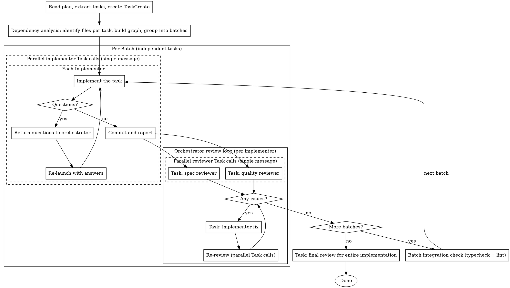

# sd-plan-dev Model Selection + Review Process Cleanup

> **For Claude:** REQUIRED SUB-SKILL: Use sd-plan-dev to implement this plan task-by-task.

**Goal:** Update sd-plan-dev SKILL.md to add model selection (implementer uses min(sonnet, current)) and fix review process so orchestrator manages all agents directly.

**Architecture:** All changes are in `.claude/skills/sd-plan-dev/SKILL.md`. The review process moves from task-agent-internal to orchestrator-managed. Model selection is expressed as natural language instructions.

**Tech Stack:** Markdown (SKILL.md prompt file)

---

### Task 1: Update SKILL.md

**Files:**
- Modify: `.claude/skills/sd-plan-dev/SKILL.md`

**Note:** No tests — this is a markdown prompt file, not code. All changes are in one file and interdependent.

**Step 1: Update core principle (line 10)**

Replace:
```
**Core principle:** Dependency analysis + parallel Task agents + nested parallel reviews = maximum throughput
```

With:
```
**Core principle:** Dependency analysis + parallel implementers + orchestrator-managed reviews = maximum throughput
```

**Step 2: Update Execution Method section (lines 27-35)**

Replace lines 27-35 with:
```markdown
All execution uses `Task(general-purpose)` for parallel execution.

- **implementer**: `Task(general-purpose, model: min(sonnet, current))` — implements one task, commits, reports
- **spec reviewer**: `Task(general-purpose)` — dispatched by orchestrator after implementer completes (read-only)
- **quality reviewer**: `Task(general-purpose)` — dispatched by orchestrator in parallel with spec reviewer (read-only)
- **final reviewer**: `Task(general-purpose)` — dispatched by orchestrator after all batches complete (read-only)

**Model selection:**
- **implementer**: use `min(sonnet, current model)`. If the user's current model is haiku, use haiku. Otherwise use sonnet.
- **All other agents**: inherit current model (no explicit `model` parameter).

Independent tasks run as **parallel Task calls in a single message**. After implementers complete, spec and quality reviews run as **parallel Task calls**.

**CRITICAL: Do NOT use `run_in_background: true`** — achieve parallelism by making multiple Task calls in a single message (foreground parallel). This ensures the orchestrator waits for all tasks to complete before proceeding to the next batch, and prevents Stop hooks from firing prematurely.
```

**Step 3: Replace The Process diagram (lines 39-99)**

Replace the entire `digraph process` block with:
````markdown

````

**Step 4: Replace Task Agent Prompt section (lines 123-163)**

Replace the entire "Task Agent Prompt" and "Prompt Templates" sections with:
```markdown
## Implementer Prompt

Each implementer receives a prompt based on `./implementer-prompt.md`. Fill in all `[bracketed]` sections before dispatching.

## Reviewer Dispatch

After an implementer completes and reports, the orchestrator dispatches reviewers:

1. Record the implementer's commit SHA and files changed from its report
2. Dispatch TWO parallel Task calls (single message):
   - spec reviewer — fill `./spec-reviewer-prompt.md` with task requirements + implementer report
   - quality reviewer — fill `./code-quality-reviewer-prompt.md` with implementer report + BASE_SHA/HEAD_SHA
3. If either reviewer returns CHANGES_NEEDED:
   - Re-dispatch implementer with fix instructions (all issues from both reviewers combined)
   - After fix, re-dispatch only the failed reviewers (parallel Task calls)
   - Repeat until both approve
4. Proceed to next task or batch

## Prompt Templates

- `./implementer-prompt.md` — implementer instructions
- `./spec-reviewer-prompt.md` — spec compliance review prompt
- `./code-quality-reviewer-prompt.md` — code quality review prompt
- `./final-review-prompt.md` — final integration review prompt
```

**Step 5: Update Example Workflow (lines 164-235)**

Replace with:
```markdown
## Example Workflow

\```
You: Using sd-plan-dev to execute this plan.

[Read plan file: docs/plans/feature-plan.md]
[Extract all 5 tasks with full text + create TaskCreate]

[Dependency analysis]
  Task 1 (validator): no deps
  Task 2 (auth hook): no deps
  Task 3 (login component): depends on Task 2
  Task 4 (validator update): depends on Task 1
  Task 5 (api endpoints): no deps

  Batch 1: [Task 1, Task 2, Task 5]
  Batch 2: [Task 3, Task 4]

--- Batch 1: parallel implementers ---

[3 parallel implementer Task calls in single message]

  Implementer 1: Implemented validator, tests 5/5 pass → committed
  Implementer 2: "Should auth use JWT or session?" (question returned)
  Implementer 5: Implemented endpoints, tests 3/3 pass → committed

[Answer Implementer 2 question: "JWT"]
[Re-launch Implementer 2 with answer]
  Implementer 2: Implemented auth hook with JWT, tests 4/4 pass → committed

[Orchestrator dispatches reviewers for each completed implementer]

  Task 1 reviews: [parallel] spec ✅, quality ✅ → Done
  Task 2 reviews: [parallel] spec ✅, quality ✅ → Done
  Task 5 reviews: [parallel] spec ✅, quality ❌ (magic number)
    → Re-dispatch Implementer 5 to fix → committed
    → Re-review quality ✅ → Done

[Batch 1 complete → integration check]

--- Batch 2: parallel implementers ---

[2 parallel implementer Task calls in single message]

  Implementer 3: Implemented login component → committed
  Implementer 4: Updated validator → committed

[Orchestrator dispatches reviewers]

  Task 3 reviews: [parallel] spec ❌ (missing error state), quality ✅
    → Re-dispatch Implementer 3 to fix → committed
    → Re-review spec ✅ → Done
  Task 4 reviews: [parallel] spec ✅, quality ✅ → Done

[Batch 2 complete → integration check]

--- Final ---

[Task: final review for entire implementation]
Final reviewer: All requirements met, ready to merge

Done!
\```
```

**Step 6: Update Red Flags section (lines 249-282)**

Replace the "If reviewers find issues" and "If task agent fails" subsections with:
```markdown
**If reviewers find issues:**

- Orchestrator re-dispatches implementer with all issues from both reviewers combined
- After fix, re-dispatch only the failed reviewers (parallel Task calls)
- Repeat until both approved

**If implementer fails or times out:**

- Do NOT silently proceed — the affected files may be in an indeterminate state
- Check if other tasks in the same batch depend on the failed task's output
- Independent tasks' results still stand
- Escalate to user with specific error details before proceeding
- Do NOT re-launch on potentially partially-modified files without inspection
```

Also update the first "Never" list item about "task agent" references to "implementer".

**Step 7: Commit**

```bash
git add .claude/skills/sd-plan-dev/SKILL.md
git commit -m "refactor(sd-plan-dev): orchestrator-managed reviews and model selection"
```
