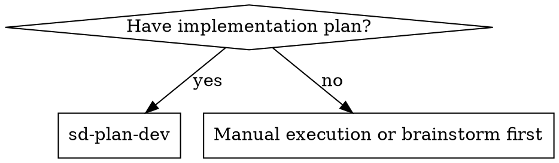
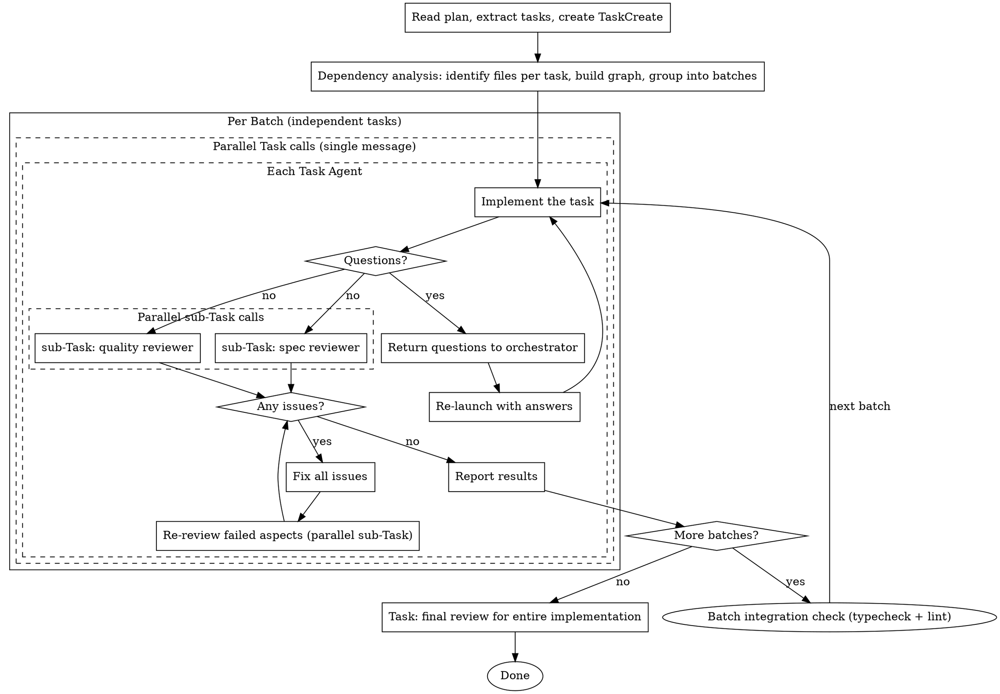

# Parallel Plan Execution

Execute plan tasks via parallel Task agents with dependency-aware scheduling.

**Core principle:** Dependency analysis + parallel Task agents + nested parallel reviews = maximum throughput

## When to Use



## Execution Method

All execution uses `Task(general-purpose)` for parallel execution.

- **task agent**: `Task(general-purpose)` — implements one task, launches sub-Tasks for review, fixes issues
- **spec reviewer**: `Task(general-purpose, model: "opus")` — sub-Task launched by task agent (read-only)
- **quality reviewer**: `Task(general-purpose, model: "opus")` — sub-Task launched by task agent (read-only)

Independent tasks run as **parallel Task calls in a single message**. Within each task agent, spec and quality reviews also run as **parallel sub-Task calls**.

## The Process



## Dependency Analysis

Before launching tasks, analyze the plan to build a dependency graph:

1. **For each task**: identify which files/modules it will create or modify
2. **Find overlaps**: tasks touching the same files depend on each other
3. **Respect logical dependencies**: if task B uses what task A creates, B depends on A
4. **Group into batches**: tasks with no dependencies between them form one batch

```
Example: 5 tasks
  Task 1: creates utils/validator.ts
  Task 2: creates hooks/useAuth.ts
  Task 3: creates components/Login.tsx (uses hooks/useAuth.ts)
  Task 4: modifies utils/validator.ts
  Task 5: creates api/endpoints.ts

  Batch 1: [Task 1, Task 2, Task 5] — independent, parallel
  Batch 2: [Task 3] — depends on Task 2
  Batch 3: [Task 4] — depends on Task 1
```

## Task Agent Prompt

Each task agent receives a prompt combining implementation + review instructions:

```
You are implementing and reviewing Task N: [task name]

## Task Description

[FULL TEXT of task from plan]

## Context

[Scene-setting: where this fits, dependencies, architectural context]

## Your Job

1. Implement exactly what the task specifies
2. Write tests (following TDD if task says to)
3. Verify implementation works
4. Self-review: did I implement everything? Did I over-build?
5. Commit your work (record the BASE_SHA before and HEAD_SHA after)
6. Launch TWO parallel sub-Tasks (spec review + quality review):
   - Sub-Task 1: spec reviewer — send spec-reviewer-prompt.md based prompt
   - Sub-Task 2: quality reviewer — send code-quality-reviewer-prompt.md based prompt, include BASE_SHA and HEAD_SHA
7. If either reviewer finds issues → fix them → re-review only failed aspects (parallel sub-Tasks again)
8. Repeat until both reviewers approve
9. Report back with: what you implemented, test results, files changed, commit SHA, review outcomes

If you have questions about requirements — return them immediately WITHOUT implementing. Don't guess.
If you encounter unexpected issues mid-implementation — ask rather than guess.

Work from: [directory]
```

## Prompt Templates

- `./implementer-prompt.md` — base implementer instructions (referenced by task agent)
- `./spec-reviewer-prompt.md` — spec compliance review sub-Task prompt
- `./code-quality-reviewer-prompt.md` — code quality review sub-Task prompt

## Example Workflow

```
You: Using sd-plan-dev to execute this plan.

[Read plan file: docs/plans/feature-plan.md]
[Extract all 5 tasks with full text + create TaskCreate]

[Dependency analysis]
  Task 1 (validator): no deps
  Task 2 (auth hook): no deps
  Task 3 (login component): depends on Task 2
  Task 4 (validator update): depends on Task 1
  Task 5 (api endpoints): no deps

  Batch 1: [Task 1, Task 2, Task 5]
  Batch 2: [Task 3, Task 4]

--- Batch 1: parallel ---

[3 parallel Task calls in single message]

  Task 1 agent:
    - Implemented validator, tests 5/5 pass
    - Parallel sub-Tasks: spec ✅, quality ✅
    → Done

  Task 2 agent:
    - "Should auth use JWT or session?" (question returned)

  Task 5 agent:
    - Implemented endpoints, tests 3/3 pass
    - Parallel sub-Tasks: spec ✅, quality: Issues (magic number)
    - Fixed magic number
    - Parallel re-review: quality ✅
    → Done

[Answer Task 2 question: "JWT"]
[Re-launch Task 2 agent with answer]

  Task 2 agent:
    - Implemented auth hook with JWT, tests 4/4 pass
    - Parallel sub-Tasks: spec ✅, quality ✅
    → Done

[Batch 1 complete]

--- Batch 2: parallel ---

[2 parallel Task calls in single message]

  Task 3 agent:
    - Implemented login component using Task 2's auth hook
    - Parallel sub-Tasks: spec ❌ (missing error state), quality ✅
    - Fixed error state
    - spec re-review ✅
    → Done

  Task 4 agent:
    - Updated validator with new rules
    - Parallel sub-Tasks: spec ✅, quality ✅
    → Done

[Batch 2 complete]

--- Final ---

[Task — final review for entire implementation]
Final reviewer: All requirements met, ready to merge

Done!
```

## Batch Integration Check

Between batches, run targeted verification on affected packages before starting the next batch:

```bash
pnpm typecheck [affected packages]
pnpm lint [affected packages]
```

This catches cross-task integration issues early — especially when the next batch depends on the current batch's output. Do NOT skip this even if individual task reviews passed.

## Red Flags

**Never:**
- Start implementation on main/master without explicit user consent
- Skip reviews (spec compliance OR code quality)
- Proceed with unfixed issues
- Put tasks with file overlap in the same parallel batch
- Skip dependency analysis
- Make task agent read plan file directly (provide full text instead)
- Skip scene-setting context
- Accept "close enough" on spec compliance
- Skip review loops (issue found → fix → re-review)
- Skip batch integration checks between batches

**If task agent returns questions:**
- Answer clearly and completely
- Re-launch that agent with answers included
- Other parallel agents continue unaffected

**If reviewers find issues:**
- Task agent fixes all issues from both reviewers at once
- Re-review only the failed aspects (parallel sub-Tasks)
- Repeat until both approved

**If task agent fails or times out:**
- Do NOT silently proceed — the affected files may be in an indeterminate state
- Check if other tasks in the same batch depend on the failed task's output
- Independent tasks' results still stand
- Escalate to user with specific error details before proceeding
- Do NOT re-launch on potentially partially-modified files without inspection

## After Completion

When all tasks and final review are done, if the current working directory is inside a worktree (`.worktrees/`), guide the user to:
- `/sd-worktree merge` — Merge the worktree branch back into main

## Integration

**Related skills:**
- **sd-plan** — creates the plan this skill executes
- **sd-tdd** — task agents follow TDD
- **sd-worktree** — branch isolation for worktree-based workflows
